<div align="center">
  
</div>

<div align="center">
  
</div>

<div align="center">
  
</div>

---

### 🌟 **Connect with Me**
<div align="center">
  <a href="https://www.linkedin.com/in/bibek-neupane-738562229/" target="_blank">
    
  </a>
  <a href="https://x.com/Bibekipynb" target="_blank">
    
  </a>
  <a href="mailto:your.email@gmail.com" target="_blank">
    
  </a>
</div>

<div align="center">
  
</div>

---

### 🚀 **About Me**

```python
class BibekNeupane:
    def __init__(self):
        self.name = "Bibek Neupane"
        self.location = "Nepal 🇳🇵"
        self.role = "ML Enthusiast & Student"
        self.languages = ["Python", "C", "C++"]
        self.current_focus = ["Machine Learning", "Deep Learning", "Model Deployment"]
        self.learning_philosophy = "Every single day counts! 📈"
        
    def get_daily_routine(self):
        return [
            "☀️ Start with coffee and code",
            "🤖 Dive deep into ML algorithms", 
            "📊 Experiment with data",
            "🚀 Build and deploy models",
            "📚 Learn something new",
            "🌙 Reflect and plan tomorrow"
        ]
    
    def current_goals(self):
        return {
            "short_term": "Master PyTorch and TensorFlow",
            "medium_term": "Contribute to open-source ML projects",
            "long_term": "Become an AI researcher"
        }
```

---

### 🛠️ **Tech Arsenal**

<div align="center">

#### **Languages**


#### **ML/AI Frameworks**


#### **Data Science Tools**


#### **Development Tools**


</div>

---

### 📊 **GitHub Analytics**

<div align="center">
  
  
</div>

<div align="center">
  
</div>

---

### 🏆 **GitHub Trophies**
<div align="center">
  
</div>

---

### 📈 **Contribution Graph**
<div align="center">
  
</div>

---

### 🎯 **Current Learning Path**

```mermaid
graph TD
    A[🎓 Foundation] --> B[📊 Data Science]
    B --> C[🤖 Machine Learning]
    C --> D[🧠 Deep Learning]
    D --> E[🚀 MLOps]
    E --> F[🔬 Research]
    
    style A fill:#00D9FF,stroke:#fff,stroke-width:2px,color:#000
    style B fill:#00D9FF,stroke:#fff,stroke-width:2px,color:#000
    style C fill:#00D9FF,stroke:#fff,stroke-width:2px,color:#000
    style D fill:#FF6B6B,stroke:#fff,stroke-width:2px,color:#fff
    style E fill:#4ECDC4,stroke:#fff,stroke-width:2px,color:#000
    style F fill:#45B7D1,stroke:#fff,stroke-width:2px,color:#fff
```

<div align="center">



</div>

---

### 💡 **Fun Facts**

<div align="center">
  
🔥 **Streak Goal:** 365 days of code  
🎯 **Current Focus:** Deep Learning architectures  
🌱 **Learning:** Advanced PyTorch techniques  
⚡ **Fun fact:** I debug better with coffee ☕  
🎵 **Coding Playlist:** Lo-fi beats + nature sounds  

</div>

---

### 📫 **Let's Collaborate!**

<div align="center">
  
</div>

---

<div align="center">
  
</div>

<div align="center">
  <i>⭐️ From <a href="https://github.com/bibekneupane">bibekneupane</a> with ❤️</i>
</div>
